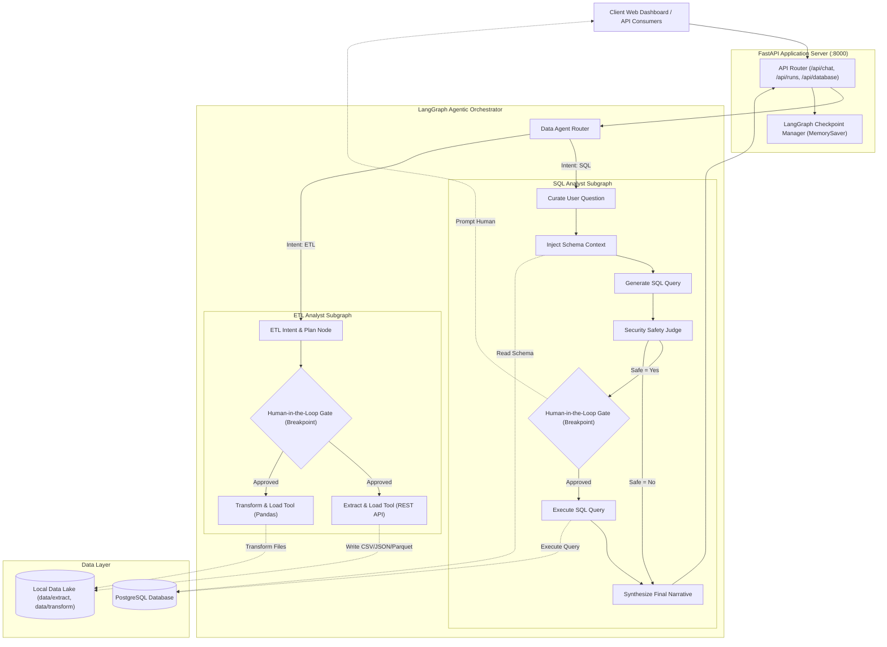
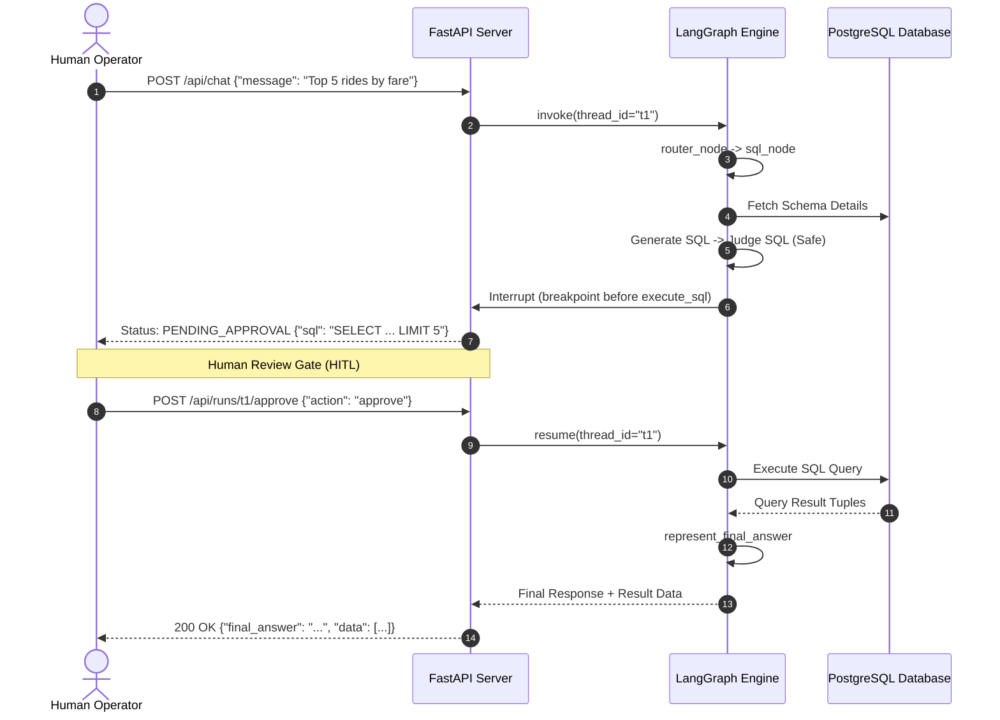

# System Architecture & Technical Specification
## AI Data Agent: Agentic Data Intelligence & ETL Platform

---

### 1. High-Level Architecture Overview

The AI Data Agent is designed around a decoupled, layered architecture consisting of a **Client Interaction Tier**, a **FastAPI Service Tier**, a **LangGraph Multi-Agent Orchestration Tier**, and a **Data Persistence Tier**.



---

### 2. Multi-Agent Pipeline & Detailed Workflows

#### 2.1 Router Graph Workflow
```
[START] 
   │
   ▼
[router_node] ── (evaluates user intent via structured LLM)
   │
   ├─► route == 'sql' ──► [sql_node] ──► [END]
   │
   └─► route == 'etl' ──► [etl_node] ──► [END]
```

#### 2.2 SQL Analyst Graph with HITL Gate
The SQL Analyst Subgraph incorporates safety evaluation and a human confirmation gate prior to running queries against the live database:

1. **`curate_ques`**: Clarifies and normalizes the user query.
2. **`prompt_query_context`**: Pulls schema metadata (tables, columns, types, sample data) from PostgreSQL using `DatabaseUtil`.
3. **`generate_sql`**: Generates a standard PostgreSQL query, enforcing row limits (`LIMIT 10` default).
4. **`is_safe_sql`**: The LLM Judge analyzes the query. Mutating queries (`INSERT`, `UPDATE`, `DELETE`, `DROP`, `ALTER`, `TRUNCATE`) are marked unsafe.
5. **`human_review_node` (HITL Gate)**:
   - If marked safe, the graph suspends execution with a LangGraph interrupt (`interrupt({"type": "sql_approval", "query": sql})`).
   - The pending state is saved in the checkpointer (`MemorySaver`).
   - The Web UI prompts the operator: **Approve & Execute**, **Modify Query**, or **Reject**.
   - Upon receiving the human action, execution resumes.
6. **`execute_sql`**: Connects via `DatabaseUtil`, executes the query, records execution time and tabular records.
7. **`represent_final_answer`**: Synthesizes the raw tuples into an accessible narrative.



#### 2.3 ETL Analyst Graph
1. **`llm_node`**: Formulates the extraction or transformation action.
2. **`hitl_etl_review`**: For dynamic Pandas transformations, generates the script and pauses for human verification before `exec()`.
3. **`tool_node`**:
   - `extract_load_tool`: Fetches from external HTTP REST APIs, parses payloads, and persists to `data/extract/{filename}.{format}`.
   - `transform_load_tool`: Reads input CSV/JSON/Parquet, applies transformations, and persists outputs to `data/transform/`.

---

### 3. Database Architecture & Schema Layout

The system connects to PostgreSQL (defaulting to the `public` schema). The sample schema represents a ride-hailing operations database:

| Table | Primary Key | Foreign Keys | Key Attributes |
| :--- | :--- | :--- | :--- |
| **`public.users`** | `user_id` | - | `first_name`, `last_name`, `email`, `city`, `user_type`, `is_active` |
| **`public.vehicles`** | `vehicle_id` | `driver_id -> users(user_id)` | `make`, `model`, `year`, `license_plate`, `color` |
| **`public.rides`** | `ride_id` | `rider_id -> users`, `driver_id -> users` | `requested_at`, `pickup_time`, `dropoff_time`, `distance_km`, `fare`, `status` |
| **`public.payments`**| `payment_id` | `ride_id -> rides`, `user_id -> users` | `amount`, `payment_method`, `payment_status`, `transaction_id` |
| **`public.ratings`** | `rating_id` | `ride_id -> rides`, `rider_id -> users`, `driver_id -> users` | `rating` (1-5), `comment`, `rated_at` |

#### Indexing Strategy
- Foreign key indexes on `vehicles(driver_id)`, `rides(rider_id, driver_id)`, `payments(ride_id, user_id)`, and `ratings(ride_id)`.
- Temporal index on `rides(requested_at)` and categorical index on `rides(status)` for time-series and status analytics.

---

### 4. Technology Stack Breakdown

- **Core Orchestrator**: LangGraph (`StateGraph`, `MemorySaver`, `Command` / conditional interrupt).
- **Backend API**: FastAPI, Uvicorn, Pydantic v2.
- **Database Connectivity**: `psycopg2-binary` connection pooling and parameterization.
- **Data Transformation**: `pandas`, `requests`, `pyarrow`.
- **LLM Integrations**:
  - OpenRouter (`ChatOpenAI` wrapper via `base_url="https://openrouter.ai/api/v1"`).
  - Google Gemini (`ChatGoogleGenerativeAI`).
  - Native OpenAI & Anthropic Claude.
- **Frontend Architecture**:
  - Vanilla HTML5 / modern CSS3 / ES6+ JavaScript.
  - Glassmorphic card styling, real-time polling, syntax highlight presentation.
  - Zero build step, served as static files from FastAPI.
